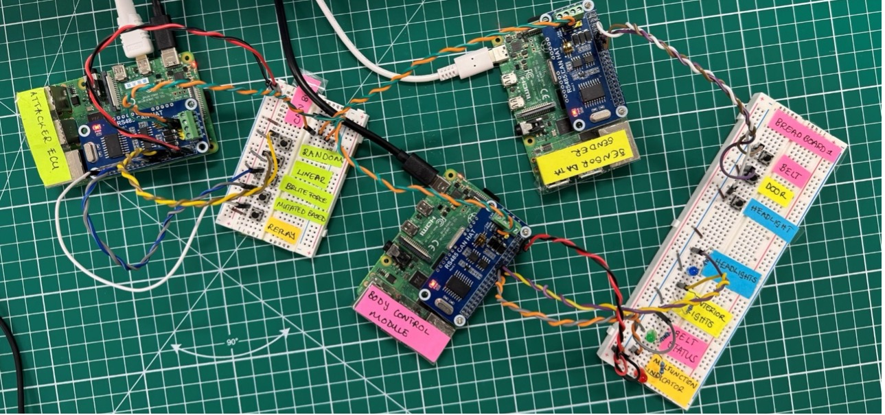

# Automotive-Cybersecurity-Risk-driven-Testing-Requirements
## Implementing MAC Tags for Fuzz Testing Resistance and Performance Analysis in Vehicle Networks

### Student Name: Linda Mafunu
### Student Number: 2216686
### Date: 12/09/2024

#### Fuzzer Folder
- Attacker ECU
- Contains Python scripts to launch fuzz tests on the Body Control Module (BCM) ECU
- Associated log files for sent fuzzing messages from sessions
  
##### Fuzz Tests:
1. Random Fuzzing
2. Linear Fuzzing
3. Brute Force Fuzzing
4. Mutation-Based Fuzzing
5. Replay Attacks
   
#### ECU2 Folder 
- Receiver/Listerner ECU
- Contains Python script for Body Control Module (BCM) ECU to simulate sensors based on received CAN messages
- Recieved messages from Belt, Door and Headlight Control Modules
- Associated response log files for sessions

#### ECU1 Folder
- Sender ECU
- Contains Python script for Belt Status Module (BSM), Door Control Modules (DCM) and Headlight Control Modules (HCM)
- CAN Messages sent to BCM to trigger sensors on the circuit
- Associated log files for messages from sessions

#### Analysis Jupiter Notebook
  - Analysis of the BCM log files for the ECU communication and Fuzz tests using statistical data and graphs

## How to run the simulation
**1. Start the Reciever ECU (i.e. Body Control Module)**
  - If it is not receiving and can messages all output sensors should be turned off
  - If Origin is DCM it should simulate the output of interior lights (Yellow LED)
  - Else if Origin is BSM it should simulate the output of Belt Status (Red LED)
  - Else if Origin is HCM it should simulate the output of headlights (Blue LED)
  - Else if an abnormal message is received or a CAN message fails MAC verification the buzzer sounds
  - The print and error output for running the BCMM.py are found in the BCM_script.log file
  - If it is receiving CAN messages each CAN message is logged in this format for example:
    ```console
        2024-10-28 15:36:09,769 CAN ID:512
        Data:bytearray(b'\x02g\x1f\xafii5%')
        Origin:DCM
        Destination:BCM
        Status:Door is Unlocked
        Error:None
        Latency:769
    ```

**2. Start Sender ECU**
  - This will send sensor data from the Door Control Module, Headlight Control Module and Belt Control Module to the Body Control Module influencing output sensors's behaviour
  - If you press the Door button it will simulate the Door Lock and Unlock status 
  - If you press the Light button it will simulate the Light levels (low and high) status
  - If you press the Belt button it will simulate the Belt ON and OFF status
  - The print and error output for running the BCMM.py are found in the Sensor_data_script.log file 

**3. Start Attacker ECU**
  - This will launch different kinds of fuzzing attacks onto the CAN bus to manipulate BCM behaviour
  - The print and error output for running the fuzzing scripts are found in the controller_script.log file
  - If you press the Random button it will run the Random Fuzzing Python script
  - If you press the Linear button it will run the Linear Fuzzing Python script
  - If you press the Brute Force button it will run the Brute Force Fuzzing Python script
  - If you press the Mutated Based button it will run the Mutated Based Fuzzing Python script
  - If you press the Replay button it will run the Replay Fuzzing Python script

### Test Bed Setup


